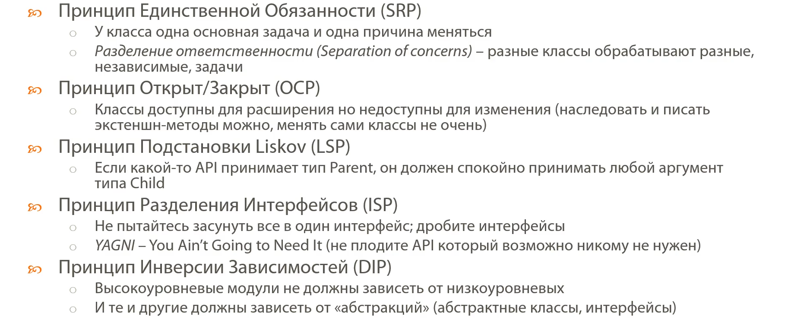
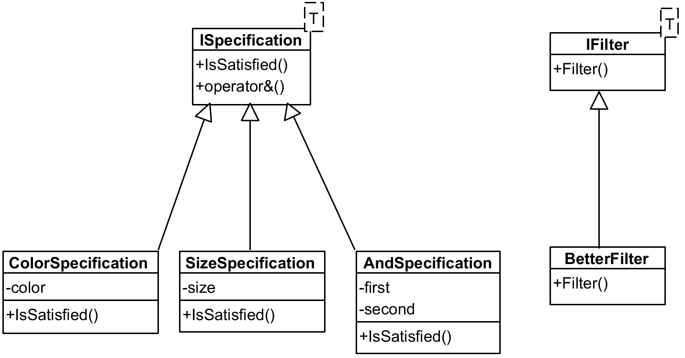
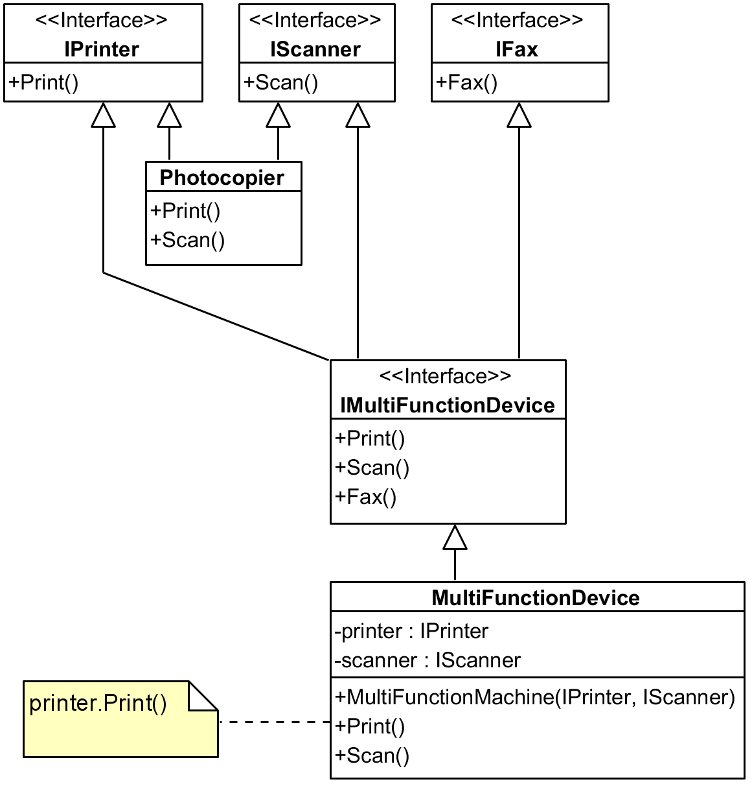

- SRP - Принцип единственной обязанности 
- OCP - Принцип открыт/закрыт (открыт для расширения, закрыт для изменения)
- LSP - Наследники должны вести себя также, как и основной класс
- ISP - Принцип разделения интерфейсов
- DIP - Принцип инверсии зависимостей (модули должны зависеть от абстракций)

